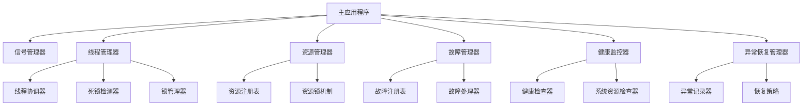

# Flexiv Robot Demo

## 项目简介
本项目为Flexiv机器人控制与仿真演示平台，支持真实机器人与仿真两种模式，集成3D可视化、URDF解析、串口通信、运动控制Primitive系统、教学与轨迹等功能。基于Flexiv RDK 1.7.0构建，提供完整的机器人控制解决方案。

## 目录结构
```
app/                # 所有Python源代码
  main.py           # 主入口
  control/          # 控制与通信模块
    primitive_manager.py    # 运动控制Primitive管理器
    robot_control.py        # 机器人控制接口
    safety_manager.py       # 安全管理
    device_manager.py       # 设备管理
    gripper_control.py      # 夹爪控制
    workcoord_manager.py    # 工作坐标系管理
    scheduler_manager.py    # 任务调度
    maintenance_manager.py  # 维护管理
    fileio_manager.py       # 文件IO管理
    serial_comm.py          # 串口通信
  core/             # 核心基础模块
    signal_manager.py       # 信号管理器
    thread_manager.py       # 线程管理器
    resource_manager.py     # 资源管理器
    fault_manager.py        # 故障管理器
    health_monitor.py       # 健康监控器
    exception_recovery.py   # 异常恢复管理器
  model/            # 机器人模型与数据
  visualization/    # 3D渲染与URDF解析
  ui/               # UI文件
resources/          # 机器人URDF、网格、配置
  urdf/             # URDF模型（已标定，可直接使用）
  meshes/           # 网格模型
  config/           # RViz等配置
tests/              # 测试文件
launch/             # ROS仿真启动文件
docs/               # 说明文档、API手册
requirements.txt    # 依赖声明
package.xml         # ROS包声明
```

## 环境要求

### 系统兼容性
| **操作系统** | **平台** | **C++编译器** | **Python版本** |
|-------------|----------|---------------|----------------|
| Linux (Ubuntu 20.04+) | x86_64, aarch64 | GCC v9.4+ | 3.8, 3.10, 3.12 |
| macOS 12+ | arm64 | Clang v14.0+ | 3.10, 3.12 |
| Windows 10+ | x86_64 | MSVC v14.2+ | 3.8, 3.10, 3.12 |

### 核心依赖
- **Flexiv RDK** >= 1.7.0
- **PyQt5** >= 5.15.11
- **NumPy** >= 1.21.0
- **PyOpenGL** >= 3.1.6
- **psutil** >= 5.9.0

## 快速启动

### 1. 环境配置
```bash
# 激活conda环境（必须）
conda activate demo-env

# 安装依赖
pip install -r requirements.txt
```

### 2. 运行程序
```bash
# 仿真模式（无需硬件）
python3 app/main.py --sim

# 硬件模式（需要连接Flexiv机器人）
python3 app/main.py --hardware
```

### 3. 模式说明
- `--sim`：仿真/教学模式，支持所有功能演示，无需真实硬件
- `--hardware`：真实机器人模式，需要Flexiv RDK和机器人连接

## 主要功能

### 🤖 机器人控制系统
- **运动控制Primitive系统**：支持MoveL、MoveJ、MovePTP、MoveC等运动控制指令
- **智能参数验证**：自动验证坐标、关节位置、速度等参数的有效性
- **动态超时管理**：根据运动速度自动调整执行超时时间
- **异常处理机制**：确保在任何情况下都能正确恢复机器人状态
- **仿真与硬件模式**：支持真实机器人与仿真两种运行模式

### 🎯 Primitive功能分类
- **工作流控制**：Home、Hold、Stop、End等基础控制
- **运动控制**：直线运动(MoveL)、关节运动(MoveJ)、点到点运动(MovePTP)、圆弧运动(MoveC)
- **力控制**：接触控制、柔顺运动、力传感器归零
- **高级功能**：零重力浮动、同步控制、视觉伺服等

### 🖥️ 可视化与交互
- **3D可视化**：旋转、缩放、平移、阴影、预设视角
- **URDF模型解析**：支持多种机器人型号(Rizon4/4s/10/10s)
- **实时状态监控**：机器人位置、速度、力矩等状态实时显示
- **URDF同步功能**：硬件模式下可同步机器人实际运动学参数

### 🔧 系统管理
- **安全管理**：急停、碰撞检测、工作空间限制
- **设备管理**：多设备连接与状态管理
- **任务调度**：支持复杂任务的分解与执行
- **串口通信**：与外部设备的数据交换
- **文件管理**：轨迹文件、配置文件的读写

### 🌐 ROS集成
- **ROS仿真支持**：与RViz、Gazebo等工具集成
- **标准接口**：符合ROS机器人控制标准

## 核心架构模块

### 1. 信号管理器 (signal_manager.py)
- 实现了基于观察者模式的信号管理器
- 定义了多种信号类型（机器人连接、运动控制、Primitive执行、安全相关等）
- 提供了信号的连接、断开和发送功能
- 使用弱引用避免内存泄漏
- 支持线程安全的操作

### 2. 线程管理器 (thread_manager.py)
- 实现了线程协调器，支持任务优先级调度
- 实现了死锁检测器，预防线程死锁
- 实现了带超时机制的锁管理器
- 提供了线程池管理和任务提交机制
- 支持上下文管理器形式的锁操作

### 3. 资源管理器 (resource_manager.py)
- 实现了资源管理器，确保线程安全的资源访问
- 支持多种资源类型（机器人、夹爪、相机、传感器等）
- 提供了资源注册、注销和访问控制机制
- 支持不同的访问模式（读、写、独占）
- 提供了资源使用统计和监控功能

### 4. 故障管理器 (fault_manager.py)
- 实现了故障注册表，定义了标准故障类型
- 实现了故障处理器，支持故障的自动恢复和手动处理
- 定义了故障级别（INFO, WARNING, ERROR, CRITICAL, FATAL）
- 定义了故障类别（硬件、软件、网络、配置等）
- 提供了恢复动作机制和回调通知

### 5. 健康监控器 (health_monitor.py)
- 实现了健康监控器，定期检查系统组件状态
- 提供了系统资源检查器（CPU、内存、磁盘）
- 提供了资源管理器检查器和线程管理器检查器
- 支持健康状态变化的回调通知
- 支持整体健康状态评估

### 6. 异常恢复管理器 (exception_recovery.py)
- 实现了异常恢复管理器，提供异常记录和恢复机制
- 支持不同严重程度的异常分类
- 提供了多种默认恢复策略（网络异常、超时错误、内存错误等）
- 支持异常上下文管理和装饰器形式的异常处理
- 提供了异常历史记录和未解决异常查询

## 核心模块架构图



## 测试与验证

### 运行测试
```bash
# 激活开发环境
conda activate demo-env

# 运行核心模块测试
python3 tests/test_core_modules_simple.py

# 运行运动控制Primitive测试
python3 tests/test_motion_primitives.py

# 类型检查
mypy app/

# 完整测试套件
pytest tests/
```

### 测试覆盖
- ✅ **运动控制Primitive**：参数验证、执行逻辑、状态管理
- ✅ **超时计算**：基于速度的动态超时时间计算
- ✅ **仿真执行**：仿真模式下的Primitive执行验证
- ✅ **坐标系统**：坐标和关节位置创建与验证
- ✅ **参数验证**：范围检查、枚举验证、类型检查
- ✅ **核心架构模块**：信号管理、线程管理、资源管理、故障处理、健康监控、异常恢复

## 文档生成
```bash
cd docs_sphinx
make html           # 生成API文档
```

## 开发指南

### 代码规范
- **代码风格**：严格遵循PEP8规范
- **类型注解**：所有函数必须添加类型注解
- **注释要求**：每20行代码至少1个功能注释
- **文档字符串**：所有公共方法必须包含docstring

### 开发流程
1. **功能开发**：在对应模块中实现新功能
2. **测试编写**：在`tests/`目录下添加测试用例
3. **类型检查**：使用`mypy`进行类型验证
4. **代码测试**：确保所有测试通过
5. **文档更新**：更新相关文档和README

### 项目架构
```
运动控制系统架构：
PrimitiveManager (核心管理器)
├── PrimitiveParams (参数定义与验证)
├── 硬件执行模块 (Flexiv RDK集成)
├── 仿真执行模块 (教学演示)
├── 超时管理 (动态计算)
└── 异常处理 (状态恢复)

核心基础架构：
主应用程序
├── 信号管理器 (松耦合通信)
├── 线程管理器 (多线程协调)
├── 资源管理器 (资源访问控制)
├── 故障管理器 (故障处理)
├── 健康监控器 (状态监控)
└── 异常恢复管理器 (异常处理)
```

### 添加新Primitive
1. 在`PrimitiveParams.PRIMITIVE_SCHEMAS`中定义参数schema
2. 实现参数验证逻辑
3. 添加执行逻辑（硬件/仿真）
4. 编写测试用例验证功能

### 使用核心模块

#### 信号管理器
```python
from app.core.signal_manager import SignalManager, SignalType

# 获取信号管理器实例
signal_manager = SignalManager()

# 定义信号处理器（必须是类的方法）
class MyClass:
    def handle_signal(self, data):
        print(f"Received signal with data: {data}")

# 连接信号
obj = MyClass()
signal_manager.connect(SignalType.SYSTEM_STATUS_UPDATED, obj.handle_signal)

# 发送信号
signal_manager.emit(SignalType.SYSTEM_STATUS_UPDATED, {"status": "running"})
```

#### 线程管理器
```python
from app.core.thread_manager import ThreadManager, Task, TaskPriority

# 获取线程管理器实例
thread_manager = ThreadManager()

# 创建任务
def my_task():
    return "task result"

task = Task(
    id="my_task_1",
    func=my_task,
    args=(),
    kwargs={},
    priority=TaskPriority.NORMAL
)

# 提交任务并获取结果
task_id = thread_manager.submit_task(task)
result = thread_manager.get_task_result(task_id, timeout=5.0)
```

#### 资源管理器
```python
from app.core.resource_manager import ResourceManager, ResourceType, AccessMode

# 获取资源管理器实例
resource_manager = ResourceManager()

# 注册资源
resource_manager.register_resource("robot_1", ResourceType.ROBOT)

# 获取资源访问权限
acquired = resource_manager.acquire_resource("robot_1", AccessMode.EXCLUSIVE)

# 使用资源
# ... resource usage ...

# 释放资源
resource_manager.release_resource("robot_1")
```

## 故障排除

### 常见问题
- **PyQt5安装失败**：尝试使用conda安装 `conda install pyqt`
- **Flexiv RDK连接失败**：检查机器人IP地址和网络连接
- **URDF加载错误**：确认mesh文件路径正确
- **OpenGL渲染问题**：更新显卡驱动程序
- **conda环境问题**：确保已激活demo-env环境 `conda activate demo-env`

### 调试模式
```bash
# 启用详细日志
python3 app/main.py --sim --debug

# 检查依赖版本
pip list | grep -E "(flexiv|pyqt|numpy|opengl|psutil)"
```

## 许可证
本项目采用MIT许可证，详见LICENSE文件。

## 贡献
欢迎提交Issue和Pull Request来改进项目。请确保：
- 遵循项目代码规范
- 添加适当的测试用例
- 更新相关文档

## 联系方式
- 项目维护：Flexiv Robotics Team
- 技术支持：请通过GitHub Issues提交问题
- 文档反馈：欢迎改进建议

---
**Flexiv Robot Demo** - 让机器人控制变得简单而强大 🚀